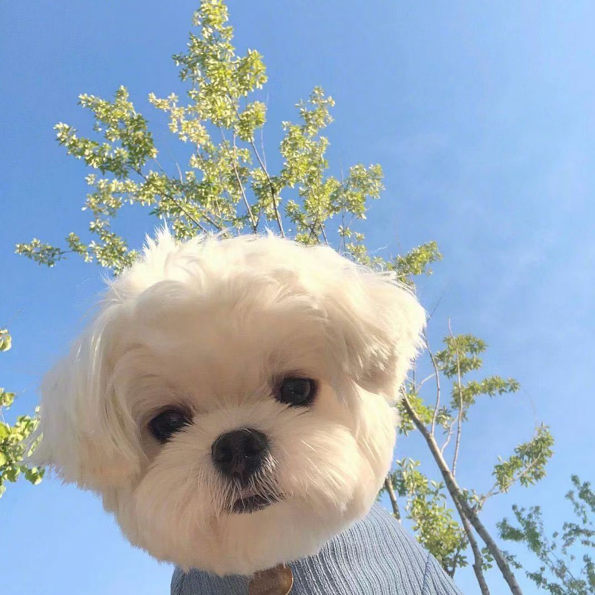
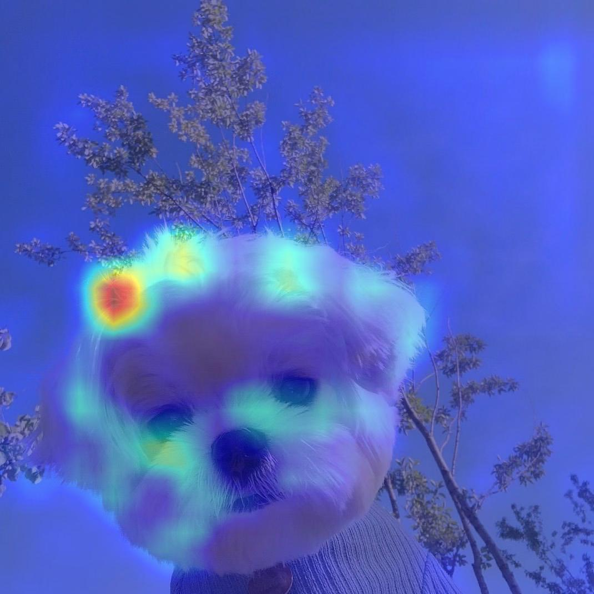

Grad-cam: Visual explanations from deep networks via gradient-based localization.

代码分析

# 运行方法
直接运行 test.py 文件

# 运行结果

| input image  |  cam image    | 
| ---- | ---- | 
|  |  |

# 关键步骤


- 得到forward的feature
```
output = self.activations_and_grads(input_tensor) # (1, 3, 1069, 1070)
# activations_and_grads实际是一个包装过的model, 里面自定义了hook函数，这里推断一次数据，提取forward的feature
```

- 得到backward的gradient 
```
self.model.zero_grad()
        loss = self.get_loss(output, target_category)   # 对target class计算一次loss，则得到的gradient也是针对target class的
        loss.backward(
            retain_graph=True) 
grads = self.activations_and_grads.gradients[0].shape # (1, 2048, 34, 34)
# retain_graph如果设置为False，计算图中的中间变量（即gradient）在计算完后就会被释放。
# 但是在平时的使用中这个参数默认都为False从而提高效率，和creat_graph的值一样。
```
- 根据梯度计算weight
```
weights = np.mean(grads, axis=(2, 3)) # (1, 2048, 34, 34) - (1, 2048)
```

-  weight * feature 对特征加权求和
```
weighted_activations = weights[:, :, None, None] * activations  #(1, 2048, 1, 1) * (1, 2048, 34, 34) - (1, 2048, 34, 34) 
```  

- global average pooling 得到CAM
```
cam = weighted_activations.sum(axis=1)  # 1, 34, 34
```

- min-max scale归一化，方便可视化
```
cam[cam < 0] = 0  # works like mute the min-max scale in the function of scale_cam_image
cam = cam - np.min(cam)
cam = cam / (1e-7 + np.max(cam))`````
```

- 上采样CAM到原始输入图片的size
```
cam = cv2.resize(cam, origin_size) # (1, 34, 34) - (1, 1069, 1070)
```

- 把enlarged cam叠加在原始RGB图片上

```
heatmap = cv2.applyColorMap(np.uint8(255 * cam), colormap=cv2.COLORMAP_JET) # (1069, 1070) - (1069, 1070, 3)
cam = heatmap + img 
cam = cam / np.max(cam)
cam = np.uint8(255 * cam)
```